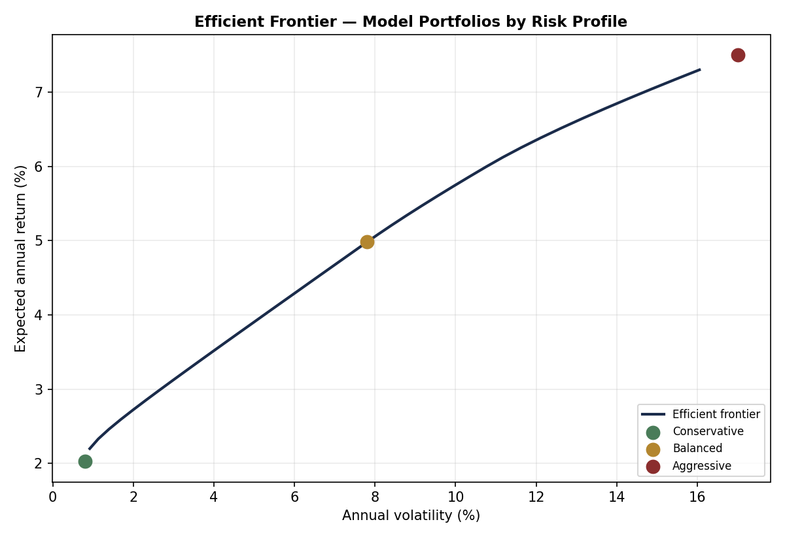

# Portfolio Risk Allocation

A small end-to-end quantitative finance project: a simplified risk-profiling
questionnaire feeds into a mean-variance (Markowitz) portfolio optimizer,
which is then backtested historically.

Built as an independent project to apply coursework in corporate finance,
econometrics, and portfolio theory to a practical wealth-management use case.

## What it does

1. **Risk profiling** — a 3-question KYC-style questionnaire (investment
   horizon, loss tolerance, primary objective) scores the client into
   Conservative / Balanced / Aggressive.
2. **Market data** — downloads historical prices for four proxy asset
   classes (Global Equity, IG Bonds, HY Bonds, Cash) via `yfinance` and
   derives annualized expected returns, volatility, and correlations. Falls
   back to illustrative capital market assumptions if offline.
3. **Portfolio optimization** — builds the efficient frontier and three
   model portfolios (minimum-variance, maximum-Sharpe, maximum-return under
   a volatility cap) using `scipy.optimize`.
4. **Backtest** — computes annualized return, volatility, Sharpe ratio, and
   maximum drawdown for the portfolio matching the client's risk profile.

## Project structure

```
portfolio-risk-allocation/
├── main.py                    # orchestrates the full pipeline
├── requirements.txt
├── src/
│   ├── data_loader.py         # market data + fallback assumptions
│   ├── risk_profiling.py      # questionnaire and scoring
│   ├── portfolio_optimizer.py # Markowitz optimization
│   └── backtest.py            # historical / simulated backtest
└── outputs/                   # generated charts (created on run)
```

## Running it

```bash
pip install -r requirements.txt

# Interactive questionnaire
python main.py

# Or skip the questionnaire with a fixed profile
python main.py --profile Balanced
```

Requires an internet connection to fetch live data via `yfinance`; without
it, the pipeline still runs end-to-end using clearly labeled illustrative
assumptions instead of historical data.

## Example output

**Efficient frontier and model portfolios:**



## Methodology notes and limitations

This project is meant to demonstrate the mechanics of portfolio construction,
not to be investment advice or a production-grade risk system. Specifically:

- **Normality assumption**: mean-variance optimization assumes returns are
  normally distributed and that historical/assumed moments are stable going
  forward. Neither holds exactly in practice.
- **Estimation sensitivity**: Markowitz optimization is known to be highly
  sensitive to the input expected returns (Michaud, 1989) — small changes in
  assumptions can produce large shifts in "optimal" weights.
- **No tail-risk modeling**: the model does not capture fat tails, regime
  changes, or liquidity crises (e.g. 2008, March 2020).
- **Simplifications**: no transaction costs, taxes, or rebalancing bands;
  fixed weights over the backtest period; four broad asset-class proxies
  rather than a fully diversified universe.
- **Risk profiling**: the 3-question questionnaire is a simplified
  illustration. Real KYC/suitability assessments used by wealth managers are
  longer, regulated (e.g. MiFID II in the EU), and combine more dimensions.

## Tech stack

Python · pandas · numpy · scipy · matplotlib · yfinance

## Author

Marco Bettuzzi — Economics and Statistics student, University of Turin
